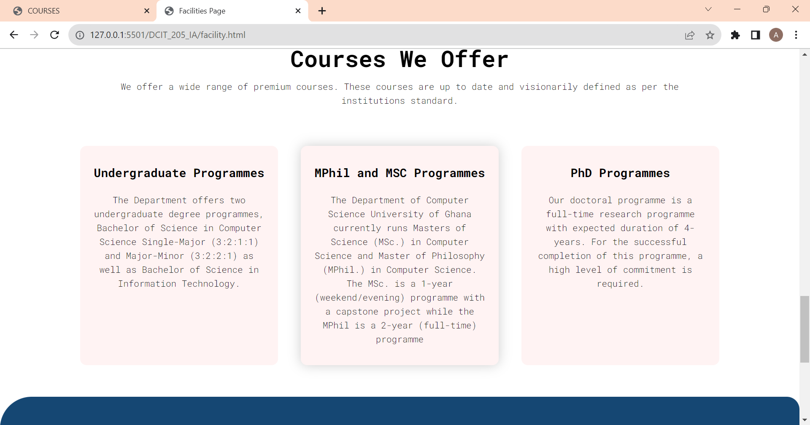
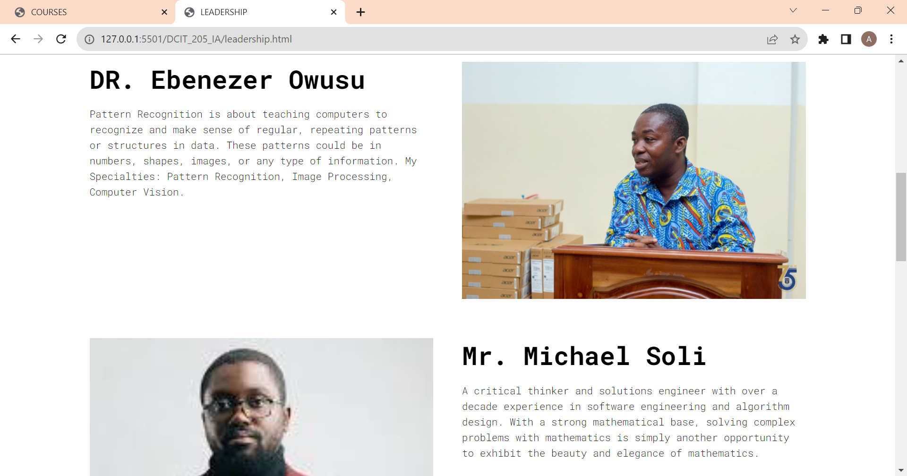

# DCIT_205_IA

## Name

    Aseda Owusu Asiedu

## Student_ID

    11130070

## BRIEF INTRO AND PURPOSE OF WEBSITE

        The website is created an educational website. It represents the Computer Science Department of Legon. The purpose of this website is to test the application knowledge of students, as well as help students understand the various multi-media concepts thought in class with various programming languages

### Setting Up Project and Cloning

    First I installed git and the github desktop on my machine. I then created a folder on my desktop to house the project.
    Then I went to github unto the page of the repository where i was to clone. Then copied th repository url 
    After cloning the git repository I went to my machines terminal and used the git clone url command, to save a copy of the repository unto my machine to start my work. 

### LESSONS LEARNT FROM PROJECT

    This project has helped broaden my scope and understanding of the various multi-media programming languages thought in class namely; HTML, CSS and JavaScript. This is because during the hours of working on it, I have learnt far more of the syntaxes and new ways to add a feature of an idea to website though extensive research work and analysis.
    Secondly, I have also learnt more about some common mistakes people do when programming, since I faced challenges with my website building and had to look into books, YouTube and other essential learning materials to correct my mistakes
    Lastly, I have gotten an understanding of how tedious and also fun coding can be. One needs to practice a lot in order to familiarize with syntaxes and blocks of code.

### Screenshot

